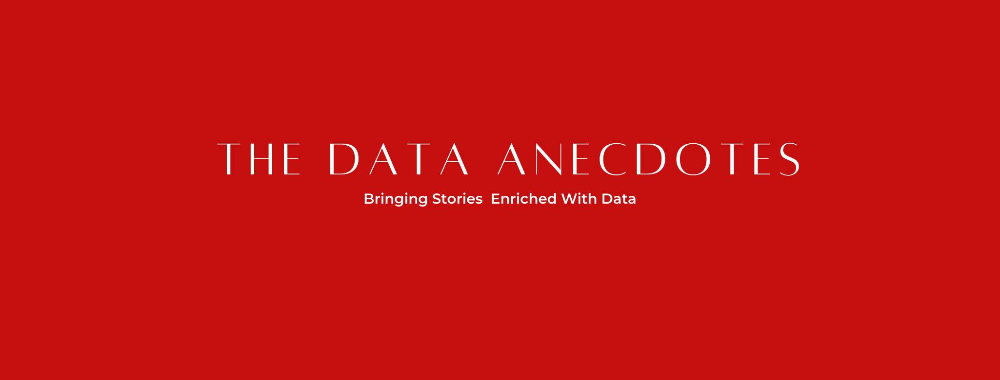

        
         
        <h2 align="center"> {Topic Name} </h2>
         
        <h3 align="center"> {Description} </h3>
 

 
  
  
  <h3> Results </h3>
  
   
   
  <h3> Contributors </h3>
  <ul>
        <li> Design : </li>
        <li> Analysis : </li>
        <li> Words : </li>
  </ul>

  <h3> Article Link : </h3>
